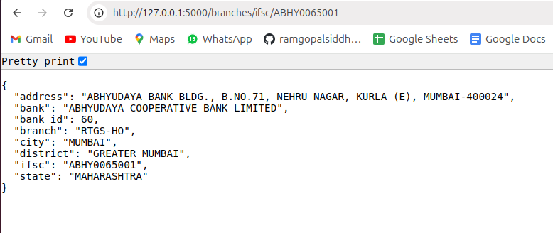

This features a Flask API for managing bank and branch data stored in a PostgreSQL database. Data is initially loaded from CSV files. The API offers endpoints to list banks, fetch paginated branch data, retrieve branches by IFSC code, and get branches by bank ID. Pagination is implemented in the /branches/ endpoint to efficiently handle large datasets. The application uses SQLAlchemy for ORM and is configured to run locally on port 5000. The setup involves installing dependencies, configuring the database, and running data import scripts.

# Set Up And Run Flask API

1. Set Up Your Environment
 - `python3 -m venv venv`
 - `source venv/bin/activate`

2. Install Dependencies
 - `pip install -r requirements.txt`

3. Set Up the Database
 - Create a psql database with Database name  `assignment`

4. Load Data into the Database
 - `python load_data.py`

5. Start the Flask API
 - `python app.py`

6. REST API Endpoints :

- Get All Banks: http://localhost:5000/banks/

- Get All Branches Details:  http://localhost:5000/branches/?page=1

- Get Specific Branch Details By IFSC code :  http://localhost:5000/branches/ifsc/ABHY0065001

- Get All Branches Of a Specific Bank By Bank id :  http://localhost:5000/branches/bank/60

## Screenshots 

### Home

### All Banks

### All Branches

### Search a Specific Branch by IFSC Code

### Search all Branches of a Perticuler Bank

